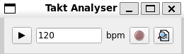

## Check your Rythm!
### Idea:
Some people struggle with rythm. I do! Which makes learning an instrument hard sometimes, espacially if there is no teacher to correct you! So we use metronemes. They are very nice, you just play to the metronom but they dont give you feedback! This app shell help you to analyize how close you are to the acutal beat.
### How to use:
The purpose of the programm is to help you, to check if you are on the beat!
It provides a small GUI:

The play buttom will simply play a beat with the bpm that you wrote in the line next to the buttom. Then you see a little record buttom. If you play it, you can hear a the beat and at the same time the program records you. Then I used "librosa" to detected the beat of your input audio wave and compare it to the played beat. 

As you can see the librossa is not perfect, since the detected beat is not always at the start of the amplitude.
### How to run:
you can check all the needed packages in the requirement.txt. Unfortunattly it runs with the simpleaudio package, which is not longer maintained! The packages does not run on WSL, which is espacially sad. So the whole programm does not run in WSL. You also need to follow the instruction for installing PySide 6 (installing some QT components). Then you can just run the main.py
